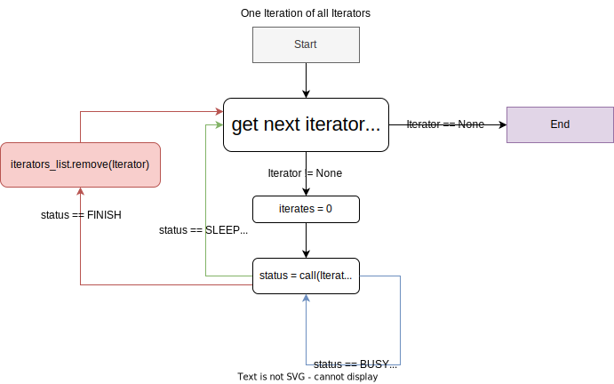
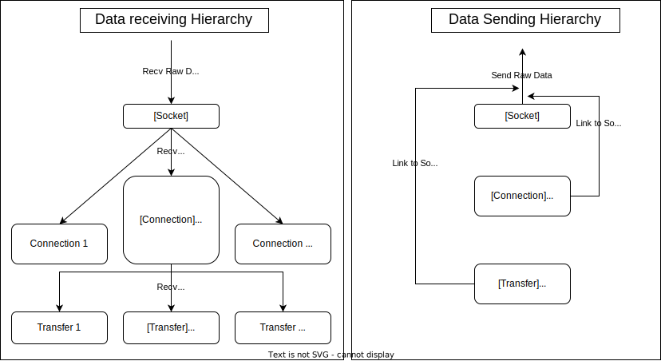
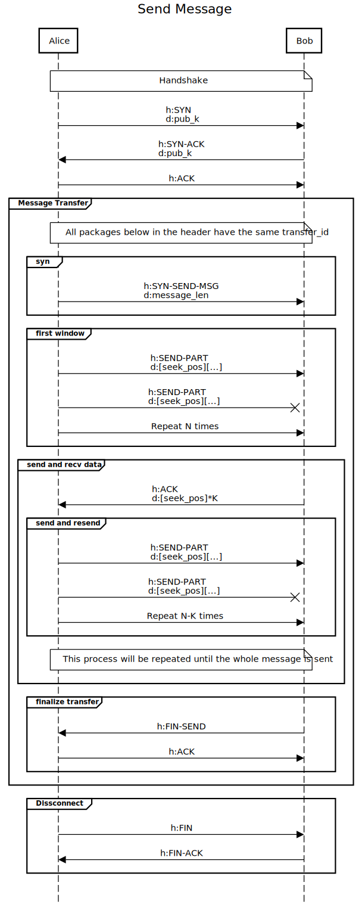
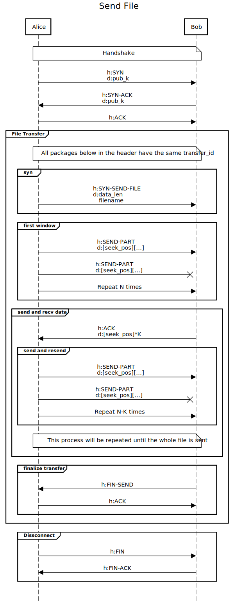

# Protected Message/File Transport Protocol specification

[](./LICENSE)
[](mailto:xchaban@stuba.sk)
[](https://github.com/ic-it/)


<!-- 
Главная идея:
Частично зашифрованный протокол, который не использует потоки для новых соединений и новых передач файлов. Может передавать более одного файла в обе стороны. За основу взят UDP протокол. 


Определимся с определениями:
Timeout: Время(в мс) после которого пакет не требует обработки.

Layer: Я постарался максимально разграничить уровни протокола. Самый низкий уровень Socket, далее идёт Connection и после него - Transfer. Смысл каждого будет объяснён ниже.

Iteration and Iterator: Весь проект построен на системе итераций. Итерации — это одно конкретное действие (например считать с потока 'recv' или обработать пакет и тд.). Итератор — это функция, которая выполняет итерацию (примеры будут ниже).
Итератор может вернуть одно из трёх состояний: SLEEP(итерация завершена), BUSY(требуется ещё время, но это не обязательно. Например, если есть пакеты для обработки и не все из них обработаны) and FINISH(Итератор убивается Сокетом). 

Socket: Самый низкий уровень в протоколе. Он отвечает за получение и отправку всех(!) пакетов, создание новых соединение, очистку "мёртвых" соединений и итерацию всех других уровней.

Connection: Следующий за Socket уровень. Он отвечает за целостность соединения, обмен публичными ключами, а так же keepalive. На этом уровне отсеиваются все пакеты, которые не прошли контроль checksum и/или у пакета случился timeout. Также этот уровень отвечает за инициализацию новых трансферов и передачу им пакетов.

Transfer (recv/send): Самый высокий уровень. На этот уровень попадают только те только пакеты, которые относятся к передаче данных. Он отвечает за целостность данных, получение, отправку, проверку, переотправку данных. Нет разницы, файл это, текст, в любом случае этот layer читает данные из BytesIO. 

Iterators List: Это список всех итераторов в сокете, которые нужны для корректной работы протокола. При вызове метода iterate_loop у Socket, Socket сделает итерации каждого итератора.

Conversation Status Manager: он является частью Connection, который представляет собой небольшую конечную машину состояний. Он управляет статусом разговора. Все пакеты из Connections сначала проходят через него.
 -->

## Introduction
A partially encrypted protocol which does not use threads for new connections and new file transfers. Can transfer more than one file in both directions. It is based on the UDP protocol. 

## Let's define terms:
- ### Timeout
    The time (in ms) after which a packet does not need to be processed.

- ### Layer
    I have tried to delimit the layers of the protocol as much as possible. The lowest layer is Socket, next comes Connection and after that Transfer. The meaning of each one will be explained below.

- ### Iteration and Iterator
    This whole project is based on an iteration system. Iterations are one specific action (e.g. read from a 'recv' stream or process a packet, etc.). An iterator is a function which iterates (examples will follow).  
    The iterator can return one of three states: SLEEP(iteration complete), BUSY(it takes more time, but this is not necessary. For example, if there are packets to be processed and not all of them are processed) and FINISH (iterator is killed by Socket). 
- ### Iterators List
    This is a list of all iterators in a socket which are needed for the protocol to work correctly. When the iterate_loop method of Socket is called, Socket will iterate each iterator.

- ### Socket
    The lowest layer in the protocol. It is responsible for receiving and sending all(!) packets, creating new connections, cleaning up "dead" connections, and iterating through all other levels.

- ### Connection
    The next layer after Socket. It is responsible for connection consistency, public key exchange, and keepalive. All packets that do not pass checksum and/or the packet has a timeout are filtered out on this level. This level is also responsible for initializing new transfers and forwarding packets to them.

- ### Transfer (recv/send) 
    The highest level. Only those packets which are related to data transfer get to this level. It is responsible for data integrity, receiving, sending, checking, re-sending data. It does not matter if it is a file or text, in any case this layer reads data from BytesIO. 
- ### Conversation Status Manager
    It is part of Connection, which is a small finite state machine. It manages the status of the conversation. All packets from Connections go through it first.


<!-- 
Как было сказано ранее, итератор - это основная исполняемая единица, которая должна выполнять одно действие. Благодаря такому подходу, появляется возможность балансировать нагрузку сокета.  

Для хранения всех итераторов используется Iterators List. Чтобы вызвать одну итерацию всех итераторов, используется метод iterate_loop у сокета. На данный момент балансировка заключается в том, что каждый итератор не может выполнять больше 40 итераций посилая сигнал BUSY. Это чем-то похоже на выделение процессорного времени.  
 -->
## Iterators List
As mentioned earlier, an iterator is a basic executable unit that must perform a single action. With this approach, it is possible to load-balance a socket.  

The Iterators List is used to store all iterators. To call a single iteration of all iterators, use the iterate_loop method of the socket. At the moment, the balancing is that each iterator cannot execute more than 40 iterations by the BUSY signal. This is something like CPU time allocation.  



<!-- 
Как же это всё же работает? (или то, как это работает без потоков)
Проще всего это показать на диаграмме, но я пожалуй опишу и текстом тоже.

Первым делом скажу, что следует разделять socket из python библиотеки socket и мою имплементацию Socket. Сейчас речь будет идти о моей имплементации, которая использует python socket.socket(получает и отправляет udp пакеты).

При создании Сокета, создаётся пара ключей. Следующим шагом происходит bind к порту сетевого интерфейса, который указал пользователь, после чего инициализируется selector для 'recv' потока и в Iterators List добавляется итератор сокета (первый по приоритету). Итератор Cокета считывает все полученные пакеты и передаёт их по соединениям и создаёт соединение если оно ранее не существовало. Соединение при получении пакета, добавляет его в очередь, чтобы не останавливать работу итератора Сокета. У сокета есть пару методов, таких как connect, disconnect, но они являются лишь прокси для методов в слое Соединения.

Когда создаётся Соединение, его итератор тоже добавляется в Iterators List. Смысл итератора в Соединении заключается в обработке пакетов относящимся к handshake, созданию Трансфера, завершении коммуникации, а так же поддержании соединения через keepalive. Также соединение инициализирует отправку сообщений и файлов.

Трансфер является самой интересной и сложной частью. Он бывает двух типов: recv and send.  
(Все пакеты которые приходят из Соединения, также добавляются в очередь и обрабатываются в итераторе) 
Итератор принимающего Трансфера обрабатывает пакеты, добавляет данные из пакета в необходимое место в BytesIO и отправляет acknowledgement в котором указывает все принятые данные. Когда он получил все необходимые данные, он отправляет пакет обозначающий финализацию Трансфера.  
Итератор отправляющего Трансфера отправляет N (N = MaxN - Wf) пакетов (Wf = Wf + N) и ждёт acknowledgement на K пакетов (Wf = Wf - K). И цикл повторяется пока не будет завершён Трансфер.  
N - Количество отправляемых пакетов
MaxN - максимальное количество отправляемых пакетов
Wf - waiting for ack packets.
K - количество полученных пакетов.
 -->

## How does it work, though? (Or how it works without threads)
The first thing I will say is that we must distinguish between socket from the python socket library and my Socket implementation. For now, I will talk about my implementation, which uses python socket.socket (receives and sends udp packets).  

When you create a Socket, creates a pair of keys. The next step is to bind to the port of the network interface that the user specified, then the selector for the 'recv' thread is initialized and a socket iterator (first in priority) is added to the Iterators List. The Socket Iterator reads all received packets and forwards them over connections, and creates a connection if one did not exist before. The connection receives a packet and adds it to the queue to keep the socket iterator running. A socket has a pair of methods, such as connect, disconnect, but they are just a proxy for the methods in the Connections layer.  

When a Connection is created, its iterator is also added to the Iterators List. The point of a connection iterator is to process packets related to handshake, create a Transfer, terminate a connection, and keepalive the connection. The connection also initializes the sending of messages and files.  

The Transfer is the most interesting and the most complex part. It comes in two types: recv and send.  
(All packets that come from the connection are also added to the queue and processed by the iterator)  
The receiving Transfer iterator processes the packets, adds data from the packet to the required place in the BytesIO and sends an acknowledgement which includes all accepted data. When it has received all the necessary data, it sends a packet denoting the finalization of the Transfer.  
The sending Transfer iterator sends N (N = MaxN - Wf) packets (Wf = Wf + N) and waits for acknowledgement on K packets (Wf = Wf - K). And the cycle repeats until the Transfer is completed.  
```
N - Number of packets to be sent
MaxN - maximum number of packets to be sent
Wf - waiting for ack packets.
K - number of received packets.
```

## Packet distribution diagram


## Protocol Specification
<!-- 
Мы уже определились с тем, как работает распределение пакетов внутри протокола, теперь я расскажу о структуре пакетов, хедере и структуре данных. После этого я расскажу о том, какая структура handshake и какая у передачи файлов и сообщений.
 -->
We have already covered how the packet distribution inside the protocol works, now I will talk about the packet structure, the header, and the data structure. After that, I will talk about what the structure of handshake is and what the file and message transfer is.

### Header
The header consists of six parts. The total size is 21 bytes.

| Name | Size | Description |
| --- | --- | --- |
| seq_number | 4 bytes | Sequence number of the packet |
| ack_number | 4 bytes | Acknowledgement number of the packet |
| flags | 1 byte | Flags of the packet |
| transfer_id | 2 bytes | Transfer ID of the packet |
| checksum | 2 bytes | Checksum of the packet |
| timeout | 8 bytes | Timeout of the packet |

On seq_number, ack_number, I don't see the point in stopping. The meaning and working principle is almost the same as in TCP.  

The **flags** field is a bit field. The meaning of each bit is as follows:
```
SYN     = 0b10000000
ACK     = 0b01000000
UNACK   = 0b00100000
FIN     = 0b00010000
SEND    = 0b00001000
PART    = 0b00000100
MSG     = 0b00000010
FILE    = 0b00000001
```
Depending on their combination (with Binary OR) we get completely different results. They will be discussed below.

The **transfer_id** field is used to identify the Transfer to which the packet belongs.

The **checksum** field is used to check the integrity of the packet. Algorithm like [RFC1071](https://tools.ietf.org/html/rfc1071)

The **timeout** field is used to sift out old and irrelevant packets.

### Data
<!-- 
Данные тоже имеют свою структуру, всплывает интересный вопрос, а почему бы не перенести фиксированные поля в раздел header? Всё просто, header я не шифрую (`\_(-._.-)_/`). А данные которые расположены в разделе Данные, конфиденциальны (например содержание файла, seek_position и тд)

Небольшая сновка, у меня реализован отдельный класс для packet, который самостоятельно генерирует checksum в header, имеет функции dump and load. +ко всему есть возможность шифровать и дешифровать данные. Забавно, что если случайно зашифровать данные, вернуть исходные у вас уже не выйдет
 -->
The data has its own structure too, an interesting question comes up, why not move the fixed fields to the header section? It's simple, I don't encrypt the header (`\_(-._.-)_/`). And the data that are located in the Data section are confidential (e.g., file content, seek_position, etc.)  

*A little twist, I have implemented a separate class for packet, which generates checksum in the header, has functions dump and load. + to all this, there is a possibility to encrypt and decrypt data. The funny thing is that if you accidentally encrypt data, you won't be able to get back the original data.*  

#### **Handshake**
<!--
Первые пакеты с хедерами SYN и SYN-ACK, имеют в себе публичные ключи двух сторон (это последние не зашифрованные пакеты). Длина ключей 64 байта (и данных соответственно).
    -->
The first packets, with `SYN` and `SYN-ACK` headers, have the public keys of the two sides (these are the last unencrypted packets). The length of the keys is 64 bytes (and data respectively).

#### **File transfer**
<!--
File transfer состоит из пакетов 4‑х типов. Отправки пакета с хедером SYN-SEND-(MSG/FILE) для инициализации, SEND-PART для отправки части данных, ACK для подтверждения успешных пакетов и SEND-FIN для завершения.

Структура SYN-SEND-MSG: 4 бита — длина данных
Структура SYN-SEND-FILE: 4 бита — длина данных и макс 999 битов для имени файла.
Структура SEND-PART: 4 бита seek_number (место в которое необходимо вставить данные)
Структура ACK: по 8 битов для каждого seek_number
Структура SEND-FIN: Ничего, он летит пустым. 
    -->
File transfer consists of 4 types of packets. Sending a packet with the SYN-SEND-(MSG/FILE) header to initialize, SEND-PART to send part of the data, ACK to acknowledge successful packets and SEND-FIN to complete.  

`SYN-SEND-MSG` structure: 4 bits - data length  
`SYN-SEND-FILE` structure: 4 bits - data length and max. 999 bytes for filename.  
`SEND-PART` structure: 4 bits seek_number (place where data is to be inserted) and max. 999 bytes for data.  
`ACK` structure: 8 bits for each seek_number  
`SEND-FIN` structure: Nothing, it flies empty.   

#### **Disconnect**
<!--
Отправка пакета с хедером FIN для завершения соединения и ожидание пакета с хедером FIN-ACK для подтверждения завершения соединения.
    -->
Sending a packet with the `FIN` header to terminate the connection and waiting for a packet with the `FIN-ACK` header to confirm the termination of the connection.

## Automatic Repeat Request (ARQ)
<!-- 
У меня реализована вариация Selective Repeat ARQ. Каждый пакет имеет свой timeout. Как только проходит timeout у определённого пакета, данные которые он хранить — пере отправляются.  -->
I have implemented a variation of Selective Repeat ARQ. Each packet has its own timeout. As soon as a certain packet runs out of timeout, the data it stores is re-sent.  

## Demonstration of communication
| Send Message | Send File |
|:---:|:---:|
|  |  |
    h is a header
    d is data

As you can see, there are few differences. Only a couple of headers and the data during initialization of the send differ.  

## client.py
This is the simplest example of using the protocol. All the basic functionality of the protocol is implemented there. When you start it, it asks you to select a network interface and asks you to enter port. Then opens the command line. All functions are described below:
```
Select IP:
0) 147.175.1.60
1) 147.175.167.65
2) 1.1.1.1
Enter number (0): 
IP: 147.175.1.60
Enter port (55644): 
[147.175.1.60:55644]>> help
connect <ip:port> - connect to ip:port
disconnect - disconnect from current connection
connections - list all connections
switch <ip:port> - switch to connection
sendfile <file> - send file
sendmsg <message> - send message
fragment <size> - set fragment size
logging <level> - set logging level
help - show this message
exit - exit
Unknown command
[147.175.1.60:55644]>> 
```

## Features
- **Handlers**: for the user to decide what to do with the received data, I have made handlers in which passed new Connections, Disconnections, Files and Messages. 
The simplest implementation is in client.py
- **checksum**: Algorithm like [RFC1071](https://tools.ietf.org/html/rfc1071). It is used to check the integrity of the data.
- **timeout**: Packet has its own timeout. If the timeout is exceeded, the data is re-sent.
- **Payload in the SEND-PART package**: Max. Payload is 999 bytes.


## Small Tests
### File Transfer With 0% Packet Loss:
File size: 11.4 MB  

| Number of files transferred simultaneously | Time | Average upload B/s (Sender)| Average download B/s (Sender)|
|:---:|:---:|:---:|:---:|
| 1 | 12s | 737997.0B/s | 6427.0B/s |
| 2 | 21s | 482111.2B/s | 4520.5B/s |
| 3 | 31s | 625036.0B/s | 6067.1B/s |

### File Transfer With 1% Packet Loss:
File size: 11.4 MB  

| Number of files transferred simultaneously | Time | Average upload B/s (Sender)| Average download B/s (Sender)|
|:---:|:---:|:---:|:---:|
| 1 | 15s | 270769.9B/s | 2425.470B/s |
| 2 | 21s | 203107.8B/s | 133524.4B/s |
| 3 | 28s | 366419.5B/s | 3649.9  B/s |


## License
This project is licensed under the MIT License - see the [LICENSE](./LICENSE) file for details.