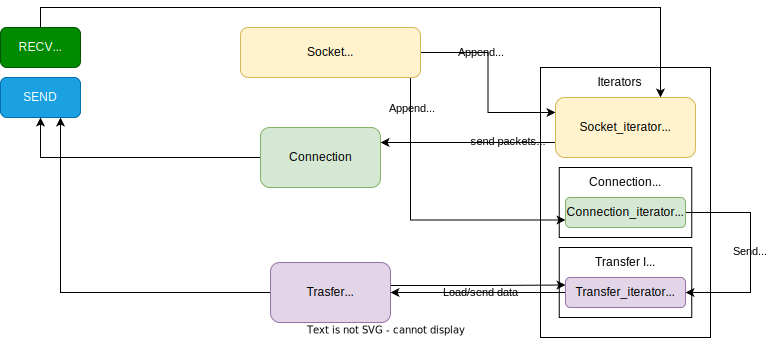

# Protected Message/File Transport Protocol specification

[](./LICENSE)
[](mailto:xchaban@stuba.sk)
[](https://github.com/ic-it/)


## Contents
- [Introduction](#introduction)
- [Header structure](#header-structure)
    - [SEQ Number field](#seq-number-field)
    - [ACK Number field](#ack-number-field)
    - [Flags field](#flags-field)
        - [SYN flag](#syn-flag)
        - [ACK flag](#ack-flag)
        - [UACK flag](#ack-flag)
        - [FIN flag](#fin-flag)
        - [SEND flag](#send-flag)
        - [PART flag](#part-flag)
        - [MSG flag](#msg-flag)
        - [FILE flag](#file-flag)
        - [KAL flag](#kal-flag)
    - Flags Combinations
        - [SYN-ACK](#syn-ack)
        - [ACK-FIN](#ack-fin)
        - [SYN-SEND-MSG](#syn-send-msg)
        - [SYN-SEND-FILE](#syn-send-file)
        - [SEND-PART-MSG](#send-part-msg)
        - [SEND-PART-FILE](#send-part-file)
        - [FIN-SEND](#fin-send)
    - [Window Size field](#window-size-field)
    - [Checksum field](#checksum-field)
        - [Checksum calculation](#checksum-calculation)
    - [Length field](#length-field)
    - [Header schema](#header-schema)
- [Data structure](#data-structure)
    - [SYN](#syn-data-structure)
    - [SYN-ACK](#syn-ack-data-structure)
    - [SYN-SEND-MSG](#syn-send-msg-data-structure)
    - [SYN-SEND-FILE](#syn-send-file-data-structure)
    - [SEND-PART-MSG](#send-part-msg-data-structure)
    - [SEND-PART-FILE](#send-part-file-data-structure)
- [ARQ (Automatic Repeat Request)](#arq-automatic-repeat-request)
- [Keep Alive](#keep-alive)
- [Error handling](#error-handling)
    - [Packet Error](#packet-error)
    - [Connection Error](#connection-error)
- [Encryption](#encryption)
- [Diagrams](#uml-diagrams)
- [Features](#features)

## Introduction
First by first, my protocol will be based on the [UDP](https://wikipedia.org/wiki/User_Datagram_Protocol) protocol, but I guarantee data integrity (It will be [TCP](https://wikipedia.org/wiki/Transmission_Control_Protocol) like). And maybe I will add RSA encryption to the protocol. (Or at least Caesar cipher XD)

## Header structure

### SEQ Number field
This field is 32-bit long and it is used to identify the sequence number of the packet. It is used to identify the order of the packets. 

### ACK Number field
This field is 32-bit long and it is used to identify the sequence number of the packet that is being acknowledged. It is used to identify the order of the packets.

### Flags field
This field is 9-bit long and it is used to identify the type of the packet.
| SYN | ACK | UACK | FIN | SEND | PART | MSG | FILE | KAL  | COMBINATION |
|:---:|:---:|:----:|:---:|:----:|:----:|:---:|:----:|:----:| :---------: |
|  1  |  0  |  0   |  0  |  0   |  0   |  0  |  0   |  0   | SYN         |
|  0  |  1  |  0   |  0  |  0   |  0   |  0  |  0   |  0   | ACK         |
|  0  |  0  |  1   |  0  |  0   |  0   |  0  |  0   |  0   | UACK        |
|  0  |  0  |  0   |  1  |  0   |  0   |  0  |  0   |  0   | FIN         |
|  1  |  1  |  0   |  0  |  0   |  0   |  0  |  0   |  0   | SYN-ACK     |
|  0  |  1  |  0   |  1  |  0   |  0   |  0  |  0   |  0   | ACK-FIN     |
|  1  |  0  |  0   |  0  |  1   |  0   |  1  |  0   |  0   | SYN-SEND-MSG|
|  1  |  0  |  0   |  0  |  1   |  0   |  0  |  1   |  0   | SYN-SEND-FILE|
|  0  |  0  |  0   |  0  |  1   |  1   |  1  |  0   |  0   | SEND-PART-MSG|
|  0  |  0  |  0   |  0  |  1   |  1   |  0  |  1   |  0   | SEND-PART-FILE|
|  0  |  0  |  0   |  1  |  1   |  0   |  0  |  0   |  0   | FIN-SEND    |
|  0  |  0  |  0   |  0  |  0   |  0   |  0  |  0   |  1   | KAL         |

- #### SYN flag
    - Syncronization flag
    - This flag is used to identify the packet as a initial packet. It is used to start the connection.
    - #### SYN-ACK
        - This flag is used to identify the packet as a initial packet. It is used to start the connection.
- #### ACK flag
    - Acknowledgment flag
    - This flag is used to identify the packet as a acknowledgment packet.
- #### UACK flag
    - UnAcknowledgment flag
    - This flag is used to identify the packet as a unacknowledgment packet.
- #### FIN flag
    - Finish flag
    - This flag is used to identify the packet as a finish packet.
    - In single, this flag is used to identify the last packet of the communication.
    - #### ACK-FIN
        - This flag combination is used to identify the packet as a acknowledgment packet and a finish packet.
- #### SEND flag
    - Send Data Flag
    - This flag is used to identify the packet as a data packet.
    - #### SYN-SEND-MSG
        - This flag combination is used to identify the packet as a initial packet and a message packet.
    - #### SYN-SEND-FILE
        - This flag combination is used to identify the packet as a initial packet and a file packet.
    - #### FIN-SEND
        - This flag combination is used to identify the packet as a finish packet and a data packet.
- #### PART flag
    - Part of Data Flag
    - This flag is used to identify the packet as a part of the data packet.
    - #### SEND-PART-MSG
        - This flag combination is used to identify the packet as a data packet and a message packet.
    - #### SEND-PART-FILE
        - This flag combination is used to identify the packet as a data packet and a file packet.
- #### MSG flag
    - Message Flag
    - This flag is used to identify the packet as a message packet.
- #### FILE flag
    - File Flag
    - This flag is used to identify the packet as a file packet.
- #### KAL flag
    - Keep Alive Flag
    - This flag is used to identify the packet as a keep alive packet.

### Window Size field
This field is 16-bit long and it is used to identify the size of the window.

### Checksum field
This field is 16-bit long and it is used to identify the checksum of the packet.

- #### Checksum calculation
    Checksum like TCP is calculated by adding all the 16-bit words of the packet and then adding the carry bits. The checksum is the one's complement of the sum.

### Length field
This field is 16-bit long and it is used to identify the length of the packet.

### Header schema
```
            111111 11112222 22222233
 01234567 89012345 67890123 45678901
+--------++-------+--------+--------+
|             SEQ number            | 32-bit
+--------++-------+--------+--------+
|             ACK number            | 32-bit
+--------++-------+--------+--------+
| Flags   |   Window Size   |         9-bit  | 16-bit
+--------++-------+--------+--------+
|    Checksum     |     Length      | 16-bit | 16-bit
+--------++-------+--------+--------+
```
FULL HEADER SIZE: 121 bits

## Data structure
### SYN data structure
```
PUBLIC KEY      | 256-bit
WINDOW SIZE     | 16-bit
```

### SYN-ACK data structure
```
PUBLIC KEY      | 256-bit
WINDOW SIZE     | 16-bit
```

### SYN SEND MSG data structure
```
MESSAGE LENGTH  | 32-bit
```
### SYN SEND FILE data structure
```
FILE NAME       | 256-bit
FILE LENGTH     | 32-bit
```
### SEND PART MSG data structure
```
MESSAGE         | in header length
```

### SEND PART FILE data structure
```
FILE            | in header length
```

## ARQ (Automatic Repeat Request)
I use [Selective Repeat](https://en.wikipedia.org/wiki/Selective_repeat) ARQ.

## Keep Alive
I use a keep alive packet to keep the connection alive. The keep alive packet is sent every 5 seconds.

## Error handling
### Packet error
If the packet is corrupted, the receiver will send an unacknowledgment packet to the sender.

### Connection error
If the connection is lost, the receiver will send a keep alive packet to the sender. If the sender doesn't receive the keep alive packet, the sender will close the connection.

# Encryption
!Not implemented yet!

# Diagram


# Features
- Libs
    - [Socket](https://docs.python.org/3/library/socket.html)
- Without threads
- Using yields (generators)
